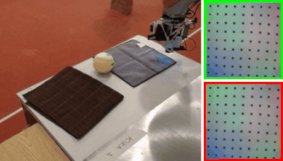
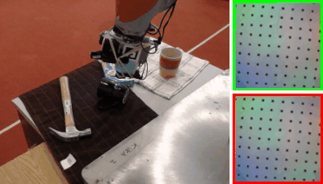
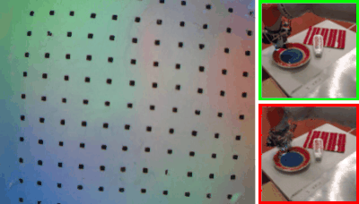
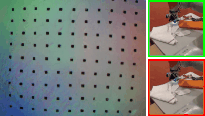

# Connecting Touch and Vision via Cross-Modal Prediction

Yunzhu Li, Jun-Yan Zhu, Russ Tedrake, Antonio Torralba 

**CVPR 2019**
[[website]](http://visgel.csail.mit.edu/) [[paper]](http://visgel.csail.mit.edu/visgel-paper.pdf)

## Installation

This code base is tested with Ubuntu 16.04 LTS, Python 3.7, and PyTorch 0.3.1. Other versions might work but are not guaranteed.

Install PyTorch 0.3.1 using anaconda

    conda install pytorch=0.3.1 cuda90 -c pytorch

Install opencv and imageio

    conda install -c conda-forge opencv
    conda install -c conda-forge imageio-ffmpeg

## Demo

Download pretrained checkpoints (~500 MB) and example data (~570 MB)

    bash scripts/download_ckps.sh
    bash scripts/download_demo.sh

Evaluate the pretrained checkpoints on the example data

    bash scripts/demo_vision2touch.sh
    bash scripts/demo_touch2vision.sh

The results are store in `dump_vision2touch/demo` or `dump_touch2vision/demo`.

Following are a few examples where the green box indicates the ground truth and the predictions from our model are shown in red.

### Vision to Touch

 &nbsp;&nbsp; 

### Touch to Vision

 &nbsp;&nbsp; 

## Training

Download data lists (~430 MB), data where the objects are considered as seen (328 GB) and data where the objects are considered as unseen (83.2 GB).

    bash scripts/download_data_lst.sh
    bash scripts/download_data_seen.sh
    bash scripts/download_data_unseen.sh

Train the vision2touch or touch2vision model using the corresponding script.

    bash scripts/train_vision2touch.sh
    bash scripts/train_touch2vision.sh

## Evaluation

Make sure the data lists, `data_seen` and `data_unseen` are in place. Run the following scripts to evaluate the trained model.

    bash scripts/eval_vision2touch.sh
    bash scripts/eval_touch2vision.sh

For Vision to Touch, the deformation error for seen objects is `0.6439` and the error for unseen objects is `0.7573`.

## Citation

If you find this codebase useful in your research, please consider citing:

    @inproceedings{li2019connecting,
        Title={Connecting Touch and Vision via Cross-Modal Prediction},
        Author={Li, Yunzhu and Zhu, Jun-Yan and Tedrake, Russ and Torralba, Antonio},
        Booktitle = {CVPR},
        Year = {2019}
    }
